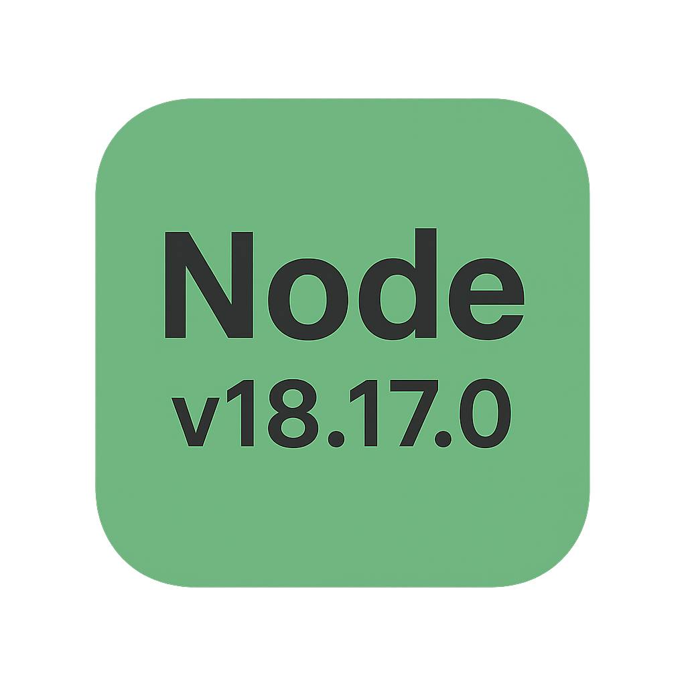
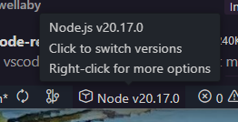
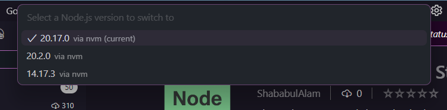

# Node Version Switch Status Bar

A powerful VS Code extension that displays your current Node.js version in the status bar and allows easy switching between installed versions using popular version managers.



## Screenshots



*The extension displays your current Node.js version in the status bar*



*Click to open the version picker and switch between installed versions*

## Features

- **🚀 Version Switching**: Click status bar to instantly switch between installed Node.js versions
- **🛠️ Multi-Manager Support**: Works with nvm, fnm, and volta version managers
- **📦 Install New Versions**: Install new Node.js versions directly from VS Code
- **📋 One-Click Copy**: Copy version to clipboard via command palette
- **🔄 Auto-Refresh**: Optional automatic refresh at custom intervals
- **⚙️ Highly Customizable**: Personalize display format and behavior
- **🛡️ Smart Error Handling**: Clear indicators with actionable suggestions
- **🎯 Lightweight**: Minimal performance impact on VS Code

## Installation

### From VS Code Marketplace
1. Open VS Code
2. Go to Extensions (`Ctrl+Shift+X`)
3. Search for "Node Version Switch Status Bar"
4. Click "Install"

### Manual Installation
1. Download the `.vsix` file from the releases page
2. Open VS Code
3. Press `Ctrl+Shift+P` and run "Extensions: Install from VSIX..."
4. Select the downloaded file

## Usage

### Quick Start
1. **View Current Version**: The extension automatically displays your Node.js version in the status bar
2. **Switch Versions**: Click the status bar item to open version picker
3. **Install New Versions**: Use Command Palette → "Node Version: Install Node Version"

### Supported Version Managers

The extension automatically detects and works with:

| Manager | Support | Installation | Switching |
|---------|---------|--------------|-----------|
| **nvm** | ✅ Full | `nvm install <version>` | `nvm use <version>` |
| **fnm** | ✅ Full | `fnm install <version>` | `fnm use <version>` |
| **volta** | ✅ Full | `volta install node@<version>` | `volta install node@<version>` |

### Quick Actions

| Action | Description |
|--------|-------------|
| **Click** status bar item | Open version picker to switch versions |
| **Command Palette** → "Switch Node Version" | Open version picker |
| **Command Palette** → "Install Node Version" | Install new Node.js version |
| **Command Palette** → "Copy Node Version" | Copy current version to clipboard |
| **Command Palette** → "Refresh Node Version" | Manually refresh displayed version |

## Configuration

Customize the extension through VS Code settings (`Ctrl+,`):

```json
{
  "nodeVersion.showInStatusBar": true,
  "nodeVersion.statusBarText": "$(symbol-method) Node {version}",
  "nodeVersion.refreshInterval": 0,
  "nodeVersion.preferredManager": "auto",
  "nodeVersion.showSwitchButton": true
}
```

### Available Settings

| Setting | Type | Default | Description |
|---------|------|---------|-------------|
| `nodeVersion.showInStatusBar` | boolean | `true` | Show/hide the Node.js version in status bar |
| `nodeVersion.statusBarText` | string | `"$(symbol-method) Node {version}"` | Custom display format. Use `{version}` as placeholder |
| `nodeVersion.refreshInterval` | number | `0` | Auto-refresh interval in seconds (0 = disabled) |
| `nodeVersion.preferredManager` | string | `"auto"` | Preferred version manager: `auto`, `nvm`, `fnm`, `volta` |
| `nodeVersion.showSwitchButton` | boolean | `true` | Enable clicking status bar to switch versions |

### Custom Display Formats

You can customize how the version appears using these examples:

```json
// Simple text
"nodeVersion.statusBarText": "Node {version}"

// With emoji
"nodeVersion.statusBarText": "⚡ {version}"

// With VS Code icons
"nodeVersion.statusBarText": "$(logo-github) Node.js {version}"
"nodeVersion.statusBarText": "$(gear) {version}"
"nodeVersion.statusBarText": "$(rocket) Node {version}"

// Minimal
"nodeVersion.statusBarText": "{version}"
```

### Version Manager Preferences

Control which version manager to use when multiple are available:

```json
// Auto-detect (default)
"nodeVersion.preferredManager": "auto"

// Force specific manager
"nodeVersion.preferredManager": "nvm"
"nodeVersion.preferredManager": "fnm" 
"nodeVersion.preferredManager": "volta"
```

## Commands

The extension provides these commands (accessible via `Ctrl+Shift+P`):

- **Node Version: Switch Node Version** - Open interactive version picker
- **Node Version: Install Node Version** - Install new Node.js versions
- **Node Version: Refresh Node Version** - Manually refresh the displayed version  
- **Node Version: Copy Node Version** - Copy the current Node.js version to clipboard

## Version Management Workflow

### Switching Between Versions

1. **Click Status Bar**: Click the Node.js version in the status bar
2. **Select Version**: Choose from the list of installed versions
3. **Automatic Switch**: The extension handles the switching via your version manager
4. **Reload if Needed**: Some changes may require reloading VS Code

### Installing New Versions

1. **Open Command Palette**: Press `Ctrl+Shift+P`
2. **Run Install Command**: Type "Node Version: Install Node Version"
3. **Choose Manager**: Select version manager if multiple are available
4. **Enter Version**: Type version number (e.g., `18.17.0`, `lts`, `latest`)
5. **Watch Terminal**: Installation progress shown in integrated terminal

### Version Formats Supported

| Format | Example | Description |
|--------|---------|-------------|
| **Specific** | `18.17.0` | Exact version number |
| **Latest** | `latest` | Latest stable release |
| **LTS** | `lts` | Latest LTS version |
| **Named LTS** | `lts/hydrogen` | Specific LTS codename |
| **Major** | `18` | Latest in major version |

## Troubleshooting

### Version Manager Not Detected

**Problem**: Status bar shows warning or no versions found

**Solutions**:
1. **Install a Version Manager**:
   ```bash
   # Install nvm (recommended)
   curl -o- https://raw.githubusercontent.com/nvm-sh/nvm/v0.39.0/install.sh | bash
   
   # Install fnm (fast alternative)
   curl -fsSL https://fnm.vercel.app/install | bash
   
   # Install volta (Rust-based)
   curl https://get.volta.sh | bash
   ```

2. **Restart VS Code** after installation
3. **Check PATH**: Ensure version manager is in your system PATH

### Node.js Version Not Showing

**Problem**: Status bar shows "Node.js not found" or warning icon

**Solutions**:
1. **Verify Installation**:
   ```bash
   node --version
   nvm --version  # or fnm --version, volta --version
   ```

2. **Install Node.js**:
   ```bash
   # Using nvm
   nvm install node
   nvm use node
   
   # Using fnm  
   fnm install --lts
   fnm use lts-latest
   
   # Using volta
   volta install node
   ```

3. **Manual Refresh**: Use "Node Version: Refresh Node Version" command

### Version Switching Not Working

**Problem**: Selected version doesn't become active

**Solutions**:
1. **Reload VS Code**: Some version managers require VS Code restart
2. **Check Terminal**: Look for error messages in the integrated terminal
3. **Manual Terminal**: Try switching manually in terminal first
4. **Path Issues**: Ensure version manager's PATH modifications are loaded

### Permission Issues

**Problem**: Extension shows error during version operations

**Solutions**:
1. **Check Permissions**: Ensure write permissions to Node.js installation directories
2. **Run as Admin**: On Windows, try running VS Code as administrator
3. **Terminal Permissions**: Check if your terminal has proper permissions

## Advanced Usage

### Workspace-Specific Versions

The extension respects `.nvmrc` files and package.json engine specifications:

```json
// package.json
{
  "engines": {
    "node": ">=18.0.0"
  }
}
```

```bash
# .nvmrc file
18.17.0
```

### Integration with Build Scripts

Use the extension with your development workflow:

```json
// package.json scripts
{
  "scripts": {
    "dev": "node --version && npm run start",
    "prebuild": "node --version"
  }
}
```

### Multiple Project Management

When working with multiple projects requiring different Node.js versions:

1. **Auto-Switch**: Extension detects version requirements
2. **Quick Switch**: Use status bar for rapid version changes
3. **Project-Specific**: Each workspace can have different active versions

## Development

### Building from Source

1. **Clone Repository**:
   ```bash
   git clone https://github.com/shababulalam/node-version-statusbar.git
   cd node-version-statusbar
   ```

2. **Install Dependencies**:
   ```bash
   npm install
   ```

3. **Compile TypeScript**:
   ```bash
   npm run compile
   ```

4. **Run in Development**:
   - Open project in VS Code
   - Press `F5` to launch Extension Development Host
   - Test features in the new VS Code window

### Available Scripts

```bash
npm run compile    # Compile TypeScript
npm run watch      # Watch for changes and compile  
npm run lint       # Run ESLint
npm run test       # Run tests
```

### Architecture

The extension is built with a modular architecture:

- **NodeVersionProvider**: Main class handling status bar and version management
- **VersionManager Interface**: Abstraction for different version managers
- **Version Detection**: Smart parsing of version manager outputs
- **Error Handling**: Comprehensive error handling and user feedback

## Contributing

Contributions are welcome! Here's how to get started:

### Development Guidelines

1. **Code Style**: Follow existing TypeScript conventions
2. **Testing**: Add tests for new features
3. **Documentation**: Update README and changelog
4. **Compatibility**: Ensure backward compatibility

### Feature Requests

Popular requested features in development:
- Automatic version switching based on project requirements
- Integration with Docker and containers  
- Support for additional version managers
- Custom installation paths
- Team/workspace version synchronization

### Bug Reports

When reporting bugs, please include:
- VS Code version
- Extension version  
- Operating system
- Version manager and versions
- Steps to reproduce
- Error messages or logs

## Changelog

### [1.1.0] - Latest Release ✨
- **Node.js Version Switching**: Click status bar to switch between versions
- **Multi-Manager Support**: nvm, fnm, and volta support
- **Install New Versions**: Direct installation from VS Code
- **Enhanced UI**: Beautiful version picker interface

### [1.0.0] - Initial Release
- Display Node.js version in status bar
- Copy version to clipboard
- Customizable display format
- Auto-refresh capability

[View Full Changelog](CHANGELOG.md)

## License

This project is licensed under the MIT License - see the [LICENSE](LICENSE) file for details.

## Support & Community

- **Issues**: [Report bugs or request features](https://github.com/shababulalam/node-version-statusbar/issues)
- **Discussions**: [Join community discussions](https://github.com/shababulalam/node-version-statusbar/discussions)  
- **Email**: sababul37@gmail.com
- **Twitter**: Share your experience with #NodeVersionStatusBar

## Acknowledgments

- Thanks to the VS Code team for excellent extension APIs
- Inspired by the Node.js community and version management tools
- Special thanks to contributors and users providing feedback

---

**Enjoy seamless Node.js version management! 🚀**

*If you find this extension useful, please consider:*
- *⭐ Starring the repository on GitHub*
- *📝 Writing a review on the VS Code Marketplace*
- *🐦 Sharing with your developer community*
- *💬 Contributing ideas and feedback*